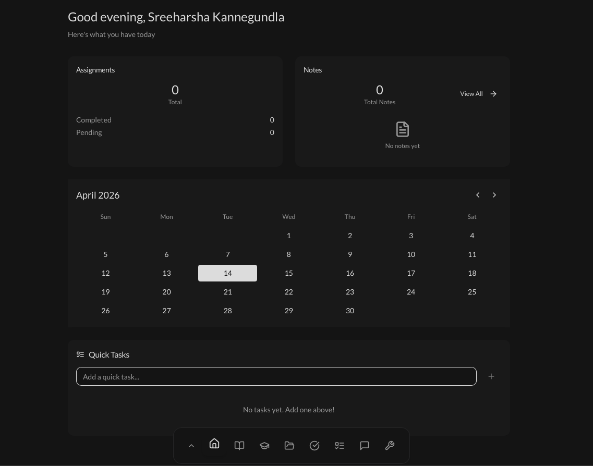

<p align="center">
  
</p>

# Alteon

> AI-powered student productivity for notes, assignments, scheduling, and study workflows.

<p align="center">
	<a href="LICENSE"></a>
	<a href="https://vitejs.dev/"></a>
	<a href="https://supabase.com/"></a>
</p>

Alteon brings notes, assignments, scheduling, and study tools into one academic workspace. It combines a React frontend with Vercel API routes, Supabase data services, Firebase Authentication, Groq AI, and Google integrations.

## Table of Contents

- [Alteon](#alteon)
- [Usage](#usage)
- [Development](#development)
- [Contributing](#contributing)
- [Release History](#release-history)
- [License](#license)
- [Meta](#meta)

## Usage

[(Back to top)](#table-of-contents)

Sign in, create your classes and assignments, and use the dashboard to organize your academic work.

### Notes

Write and organize rich-text notes, then use the AI assistant for summaries, editing, outlining, and reviewable changes.

### Planning

Track assignment priorities and due dates, manage daily tasks, and sync supported events with Google Calendar.

### Study tools

Use flashcards, Pomodoro sessions, mood tracking, AI chat, and study summaries to support focused work.

## Development

[(Back to top)](#table-of-contents)

Requirements: Node.js 18+, npm 8+, and Git.

```sh
git clone https://github.com/Creator101-commits/alteon.git
cd alteon
npm install
cp .env.example .env
```

Fill in `.env` using `.env.example` as the source of truth, then run the development server:

```sh
npm run dev
```

The app runs at <http://localhost:5173>.

Useful commands:

```sh
npm run check     # Type-check the project
npm test          # Run tests
npm run lint      # Run ESLint
npm run build     # Create a production build
```

If you change the database schema, review the changes before running `npm run db:push`. Never commit `.env` or expose server-only keys with a `VITE_` prefix.

## Contributing

[(Back to top)](#table-of-contents)

Contributions are welcome. For project-specific guidelines, see [`CONTRIBUTING.md`](./CONTRIBUTING.md).

1. Fork it (<https://github.com/Creator101-commits/alteon/fork>)
2. Create a feature branch (`git checkout -b feature/your-change`)
3. Commit your changes (`git commit -m 'feat: describe your change'`)
4. Push to the branch (`git push origin feature/your-change`)
5. Open a pull request

Please make sure tests pass and the code is formatted before opening a pull request.

## Release History

[(Back to top)](#table-of-contents)

See the [GitHub releases](https://github.com/Creator101-commits/alteon/releases) page for release history.

## License

[(Back to top)](#table-of-contents)

Distributed under the MIT License. See [`LICENSE`](./LICENSE) for more information.

## Meta

[(Back to top)](#table-of-contents)

Project: Alteon
Owner: [Creator101-commits](https://github.com/Creator101-commits)

Project link: [https://github.com/Creator101-commits/alteon](https://github.com/Creator101-commits/alteon)
